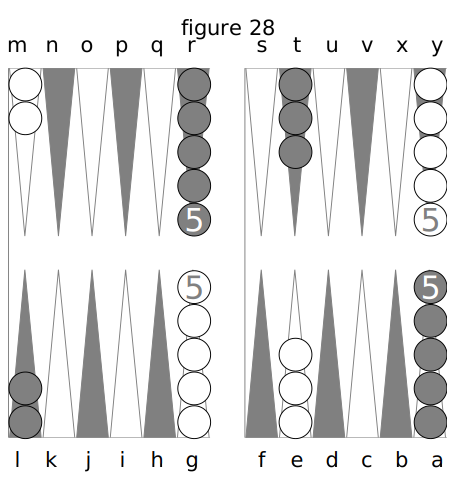
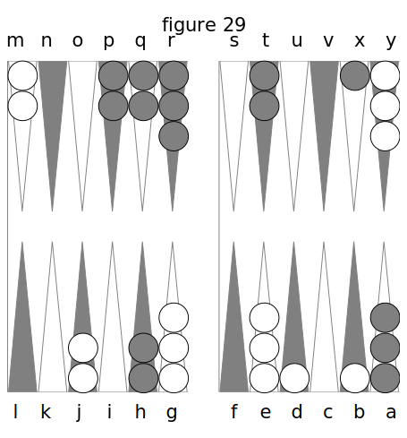
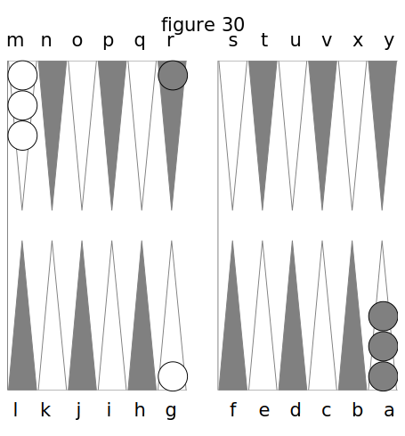

# APPENDIX. De quelques autres jeux qui se jouent dans le Trictrac. 

Outre le Trictrac, proprement dit, il existe encore d’autres jeux qui se jouent dans le meme tablier. Pour rendre ce traité complet, je vais parler sommairement de ceux qui sont les plus usités. Je n’en indiquerai guères que la marche, les combinaisons et les régies en étant trè- simples, et ne pouvant être saisies que dans la pratique.

## DU GAMMON OU TOUTES-TABLES.

Ce jeu était généralement nommé autrefois, en France, le _Toutes-tables_ ; mais le nom de _Gammon_ ou _Back-Gammon_, est celui qui prévaut aujourd’hui et qui vient des Anglais, chez lesquels il est en grand usage, car ils ne jouent presque point, ou même ignorent notre Trictrac. 

Pour le jouer, il faut placer les dames comme on le voit dans la fig. 28. 

Dans cette figure j’ai les dames blanches, dont deux sont placées vis-à-vis de moi en M, et cinq en Y, le reste de mon côté ; savoir: cinq sur G et trois sur E. Mon but est de rentrer toutes mes dames dans la région G L, d’où, aussitôt qu’elles y seront toutes, je les lèverai ou sortirai comme à la fin du Jan de retour au Trictrac, c’est-à-dire en les plaçant sur la bande que je compte de même comme une flèche. 

Or, pour cela, je joue dans la direction de M en R et de R en Y ; puis de Y en F pour passer dans G L; de sorte que je décris une ligne circulaire en jouant, et je marche dans un sens opposé à celui que je suivrais au Trictrac. 

Lorsque j’aurai réussi à passer toutes mes dames en G L, si je les sors toutes avant mon adversaire, je gagnerai la partie. 

Pour lui, il doit jouer de son coté de la même manière. C’est-à-dire qu’il cherche à passer toutes ses dames en R M en jouant de L en G, de G en A, de Y en T pour passer dans R M. 

Si dans le cours du jeu, l’un de nous deux laisse une dame isolée sur une flèche, elle peut être battue à la volonté de l’autre. Mais ici on ne marque pas de points comme au Trictrac : on prend la dame de son adversaire, on la lui remet dans la main et l’on met la sienne à sa place. Alors il faut qu’on amène des dés tels qu’il puisse _rentrer_ par le commencement de son jeu. Je suppose que ce soit moi : alors je rentre par M, N, O, P, Q, R, suivant les nombres que j’ai amenés. Si les flèches sur lesquelles tombent les nombres amenés sont occupées par des dames de mon adversaire, je ne puis rien jouer, je garde mon bois en main et j’attends à l’autre coup : c’est autant de perdu pour moi. 

Par exemple, fig. 29, j’ai été obligé de jouer deux dames sur B et D. Mon adversaire amenant ensuite 6 et 4, il bat ces deux dames découvertes, s’il veut, car il n’y est pas forcé ; mais il croit de son jeu de les battre, et en conséquence il les 6te, me les remet dans la main, pose en leur lieu et place les deux dames qui sont en H, et je suis obligé, le coup suivant, de les rentrer dans la région M R., si je puis. Mais si j’atnène bezet, ou 4 et as, ou 5 et as, ou carmes, ou quine, ou 5 et 4, etc., je ne puis les rentrer, puisque les flèches qui répondent à ces nombres en passant de la bande et comptant R pour la première, sont occupées par des cases appartenant à mon adversaire. Alors je les garde et j’attends qu’il ait joué son coup. Si après cela j’amène de nouveau quelques- uns de ces nombres, je les garde encore ; en un mot, je ne puis rentrer que par N ou O. 

Si je n’amène qu’un 2 et as ou un 3 et as, je ne rentre qu’une seule de mes dames, ou si je n’en ai plus en main, je joue l’autre nombre dans le reste de mon jeu. Après cela, si, ayant encore une en main, j’amenais 6 et 2 ou 6 et 3, je pourrais la jouer tout d’une. 

Les doublets se jouent doubles, c’est-à-dire que si l’on amène, entr’autres, un carmes, on joue 16 points au lieu de B. C’est donc presque toujours une bonne fortune qu’un doublet à ce jeu. 

Les parties de Gammon se jouent d’autant de trous que l’on veut. Ordinairement c’est en trois trous, et l’on convient d’avance de la partie double qui se gagne par celui qui a sorti toutes ses dames avant que l’autre ait seulement rentré toutes les siennes; il prend alors deux trous au lieu d’un. 

L’on voit qu’à ce jeu il n’y a pas de points à marquer, et qu’ainsi il n’y a pas d’écoles à faire. Seulement, comme au Trictrac, _dame touchée, dame jouée_. Il s’en faut de beaucoup, sans doute, que le Gammon vaille le Trictrac : il est bien moins amusant et infiniment moins difficile, quoiqu’en disent quelques joueurs qui le prétendent plus abstrait, à cause de ce qu’ils appellent _l'arrière-jeu_. Cet arrière-jeu a lieu lorsqu’un des deux joueurs, ayant rentré toutes ses dames ou presque toutes, se trouve encore battu sur des dames qu’il est obligé de découvrir par celles de son adversaire qui sont restés en arrière dans la région où il a rentré les siennes. Mais c’est une illusion de croire, pour cela, le Gammon supérieur au Trictrac : il n’est pas même digne d’entrer en comparaison avec lui. Il faut avouer pourtant, qu’après celui-ci, c’est le jeu le plus piquant et le plus difficile ; car au moment où l’on est sur le point de sortir tout-à-fait, et par conséquent de gagner, on perd la partie simple et quelquefois même double, si l’on n’a pas sorti encore une dame ; la règle étant qu’on ne peut plus prendre double quand on en a levé une seule. 

Je ne parlerai pas ici des combinaisons du jeu ; on peut facilement les apprendre de soi- même à force de jouer. Seulement je dirai que les plus beaux dés qu’on puisse amener en commençant, sont : le sonnez, bezet, 6 et as et 3 et as. Alors sonnez se joue en prenant les deux dames de M, et les plaçant en S, et deux autres de Y sur F ; bezet en en jouant deux de G sur H, et deux de E sur F ; 6 et as se joue en plaçant une dame de Y et une de E sur F ; et 3 et as en plaçant une dame de E et une de G sur H. 

Au surplus, le grand art, à ce jeu, consiste à fermer les passages, sur-tout par les 6, et à enchevêtrer tellement le jeu, que l’adversaire soit obligé de se laisser battre, ce qui le mène finalement à la perte de la partie.

## DU JACQUET.

Le Jacquet se joue ainsi : 

Chaque joueur met son talon clans un des coins en face de lui, fig. 30. J’ai le mien en M, et mon adversaire a le sien en A ; ce qui fait que les deux talons sont aux deux extrêmes de la transversale du Trictrac. Nous sommes tous les deux obligés de jouer la première dame seulement, jusqu’à ce qu’elle soit arrivée dans la partie ou région opposée à notre talon. 

Par exemple, j’amène 6 et 5 ; je joue une dame de M en Y ; mon adversaire fait aussi le même dé, et joue une dame de A en L. Ensuite j’amène 6 et as, et je joue de Y en G tout d’une ; il fait de même 6 et as, et il joue sa dame de L en R. Après cela, tous les autres coups se jouent à volonté, soit en abattant du talon, soit en jouant les darnes abattues.

Les doublets se jouent double comme au Gammon. 

Celui des deux joueurs qui a levé ou sorti le premier, gagne un trou ou deux, si on est convenu de la double.

On ne bat point au Jacquet. 

Quant aux finesses et auxcombinaisons de ce jeu, j’en parlerai encore moins que de celles du Gammon : il n’y a absolument que l’habitude et la pratique qui puissent les indiquer. D’ailleurs elles consistent uniquement à s’étendre et à occuper le plus de flèches qu’on peut, afin de fermer les passages à son adversaire, de le retarder dans les efforts qu’il fait pour rentrer le plus promptement possible, et sortir par conséquent le premier. 

Ainsi, ce jeu est encore moins difficile que le Gammon ; on peut dire qu’il est à celui-ci, ce que celui-ci est au Trictrac.

## DU GARANGUET.

Le Garanguet se joue avec trois dés. On place les talons comme au Trictrac, et l’on joue les dames de manière à les amener dans la région où est celui de son adversaire, par où l’on sort les siennes. Celui qui a sorti le premier gagne le trou ou deux, si la double a été convenue. 

Si dans les nombres qu’on amène ainsi par trois dés il se trouve un doublet, on le joue double, pourvu que l’un des deux nombres qui le composent soit plus fort que le troisième dé. Au cas contraire, on le joue comme un autre nombre.

Ainsi, si j’amène 2, 2 et 3, je joue 7 points en une, deux ou trois dames ; mais si j’amène 4, 4 et 3, je joue 16 points pour le carmes, et 3 pour le troisième dé, etc. 

Si l’on amène trois nombres égaux, ce qui forme un triplet, on les joue trois fois. 

Je dirai encore moins sur les finesses de ce dernier jeu, que sur celles des deux précédents, cela serait entièrement inutile.

FIN.
