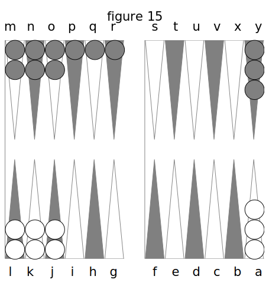
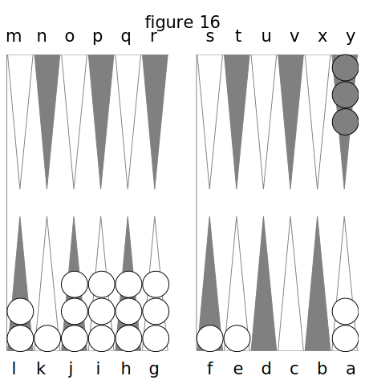
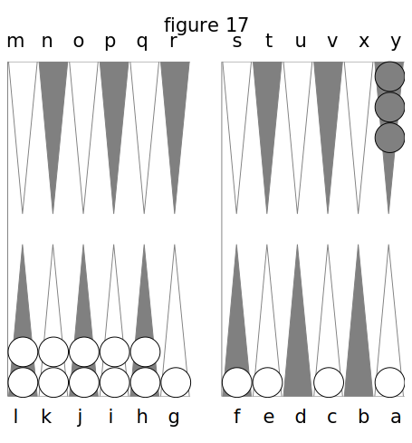
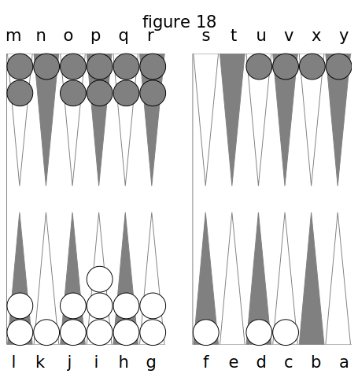
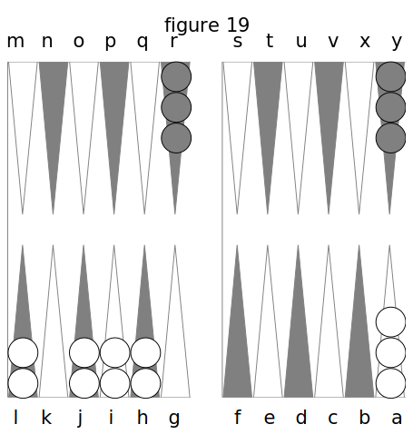
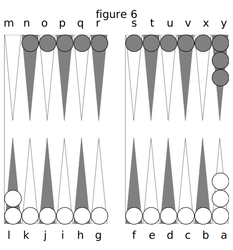
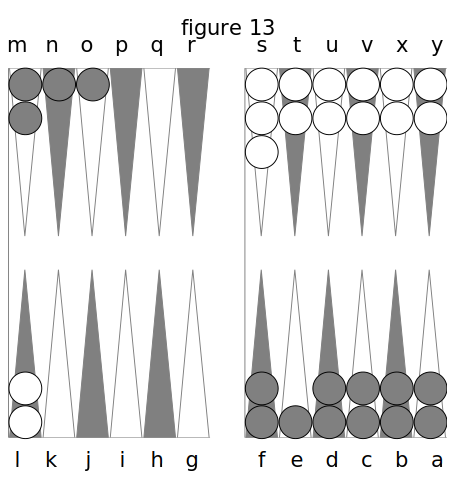
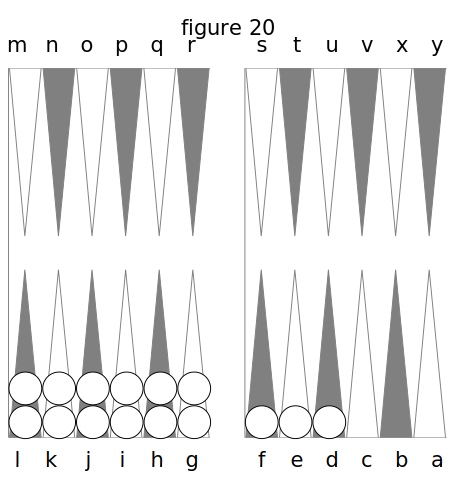

# DEUXIÈME PARTIE. DE L’ARITHMÉTIQUE DU TRICTRAC.

Aucun des auteurs qui ont écrit sur le Trictrac n’a traité l’arithmétique de ce jeu d’une manière satisfaisante. Je vais y faire découvrir des routes qui leur étaient inconnues, qu’ignoraient totalement les joueurs d’autre fois, qu’ignore même encore l’immense majorité des joueurs d’aujourd’hui. La partie que je vais traiter est donc presque tout à fait neuve : c’est la plus importante de cet ouvrage, et celle qui doit mériter le plus l’attention des amateurs.

## I. Des combinaisons produites par deux dés

Supposons que l’un des deux dés avec lesquels on joue soit rouge et l’autre noir : si l’on compare chacun des nombres inscrits sur le dé rouge avec chacun successivement de ceux inscrits sur le dé noir, on devra trouver autant de fois six combinaisons qu’il y a de nombres ou de laces sur ce dé rouge.

En effet, je prends l’as rouge, et le joignant successivement à l’as noir, au 2 noir, au 3 noir, au 4 noir, au 5 noir et au 6 noir, j’ai 

- As rouge et as noir,
- As rouge et 2 noir,
- As rouge et 3 noir,
- As rouge et 4 noir,
- As rouge et 5 noir,
- As rouge et 6 noir.

Or, si après cela je prends le 2 rouge, et que je fasse la même opération ; si le 3 rouge ; si le 4 rouge, etc., il est évident que j’aurai pour le 2, le 3, le 4, le 5 et le 6 rouges, cinq autres fois autant de combinaisons que j’en viens de trouver avec l’as rouge.

Donc j’aurai en tout six fois six combinaisons; donc il y a trente-six chances dans les coups produits par deux dés.

Sur ces trente-six chances il y en a six où les nombres de chacune ne reparaissent dans aucune des cinq autres ; ce sont celles qui résultent de l’assemblage de deux nombres égaux du dé rouge et du dé noir, telles que, as et as, 2 et 2, etc. On les appelle des doublets, et elles ont six dénominations distinctes.

Les trente autres chances ne prennent que quinze dénominations ; c’est-à-dire que les deux qui sont composées des mêmes nombres prennent une dénomination unique. Par exemple, as rouge et 2 noir, et 2 rouge et as noir sont composés de nombres transversalement égaux, puisqu’as rouge est égal à as noir, et 2 rouge à 2 noir. Ces deux chances doivent donc être énoncées d’une seule manière, en commençant par le plus grand nombre : ainsi as rouge et 2 noir, comme as noir et 2 rouge, prennent la dénomination de _2 et as_, attendu qu’on ne joue jamais qu’avec des dés d’une même couleur.

On voit, par conséquent, que les six doublets ne peuvent venir que d’une seule façon chacun, et qu’au contraire chacune des autres chances vient de deux façons ; car double as est unique, puisqu’il n’y a qu’un as dans chaque dé ; mais deux et as est double, puisqu’il se fait, soit par as rouge et 2 noir, soit par 2 noir et as rouge.

De là cette vérité : _que les coups à nombres égaux sont simples, et que les coups à nombres inégaux sont doubles._ (c’est donc encore une des mille et une niaiseries de l’auteur de l’ancien traité de JDatnon et Clons, lorsqu’il dit, que les coups simples sont doubles, et que les coups doubles sont simples. Deux et as n’est pas plus un coup simple, que bezet n'est un coup double).

Sur les trente-six chances que fournissent deux dés, il y en a quinze dont le montant des nombres de chacune est au-dessous de sept ; six dont le montant est juste sept, et les quinze autres au-dessus de sept.

|              |               |             |
|------------- | ------------- | ------------|
|2 ch. 2 et as | 2 ch. 4 et 3  | 2 ch. 5 et 3|
|2 ch. 3 et as | 2 ch. 5 et 2  | 2 ch. 5 et 4|
|2 ch. 3 et 2  | 2 ch. 6 et as | 2 ch. 6 et 2|
|2 ch. 4 et as |               | 2 ch. 6 et 3|
|2 ch. 4 et 2  |               | 2 ch. 6 et 4|
|2 ch. 5 et as |               | 2 ch. 6 et 5|
|1 ch. bezet   |               | 1 ch. carmes|
|1 ch.double 2 |               | 1 ch. quine |
|1 ch. terne   |               | 1 ch. sonnez|
|------------- | ------------- | ------------|
|15 chances    | 6 chances     | 15 chances  |

Il suit, de cet exposé, qu’un nombre composé vient d’autant de façons qu’il y a de points moins un dans ce même nombre, lorsqu’il est de sept et au-dessous, et qu’au-dessus de sept il vient d’autant de façons moins de six, qu’il s’éloigne d’unités moins six de ce même nombre six, ainsi qu’il résulte de cette énumération ;

- 2 vient une fois par bezet,
- 3 deux fois par 2 et as,
- 4 trois fois par 3 et as et double 2,
- 5 quatre fois par 3 et 2 et 4 et as 
- 6 cinq fois par 5 et as, 4 et 2 et terne,
- 7 six fois par 4 et 3, 5 et 2 et 6 et as,
- 8 cinq fois par 6 et 2, 5 et 3 et carmes,
- 9 quatre fois par 5 et 4, et 6 et 3,
- 10 trois fois par 6 et 4 et quine,
- 11 deux fois par 6 et 5.

Le nombre composé sept, comme on voit, est donc celui qui vient le plus souvent. En outre, on peut remarquer, pour la curiosité seulement, qu’en additionnait le montant de toutes les chances au-dessous de sept, elles forment un total de 70 points, et celles au-dessus de sept de 140 points.

- Chances au-dessous de sept : 70 points.
- au-dessus de sept : 140
- de 7 : 42

Total  252 points.

Somme pareille à celle du tableau suivant :

Tableau des trente-six chances, réduites à vingt-une dénominations.

| ROUGE | NOIR | DENOMINATION |
|-------|------| -------------|
|   1   |   1  |  Bezet       | 
|   2   |   2  |  Double 2    | 
|   3   |   3  |  Terne       | 
|   4   |   4  |  Carmes      | 
|   5   |   5  |  Quine       | 
|   6   |   6  |  Sonnez      | 
|   1   |   2  |  2 et as     | 
|   2   |   1  |  2 et as     | 
|   1   |   3  |  3 et as     | 
|   3   |   1  |  3 et as     | 
|   1   |   4  |  4 et as     | 
|   4   |   1  |  4 et as     | 
|   1   |   5  |  5 et as     | 
|   5   |   1  |  5 et as     | 
|   1   |   6  |  6 et as     | 
|   6   |   1  |  6 et as     | 
|   2   |   3  |  3 et 2      | 
|   3   |   2  |  3 et 2      | 
|   2   |   4  |  4 et 2      | 
|   4   |   2  |  4 et 2      | 
|   2   |   5  |  5 et 2      | 
|   5   |   2  |  5 et 2      | 
|   2   |   6  |  6 et 2      | 
|   6   |   2  |  6 et 2      | 
|   3   |   4  |  4 et 3      | 
|   4   |   3  |  4 et 3      | 
|   3   |   5  |  5 et 3      | 
|   5   |   3  |  5 et 3      | 
|   3   |   6  |  6 et 3      | 
|   6   |   3  |  6 et 3      | 
|   4   |   5  |  5 et 4      | 
|   5   |   4  |  5 et 4      | 
|   4   |   6  |  6 et 4      | 
|   6   |   4  |  6 et 4      | 
|   5   |   6  |  6 et 5      | 
|   6   |   5  |  6 et 5      | 
|-------|------|              | 
|  126  |  126 |              | 

total : 252

En effet, le montant des nombres inscrits sur les six faces du dé rouge, est de 21; celui des nombres du dé noir est aussi de 21. Or, les nombres de chacun étant répétés six fois réciproquement, donnent douze fois 21, ou 252. 

## II. Des procédés qui font connaître les coups qui battent et qui remplissent quand on a un et deux dés directs.

A présent que nous avons prouvé qu’il y a trente-six chances de dés, il reste à indiquer une manière sûre de trouver combien on a de coups pour ou contre soi, dans toutes les circonstances, telle qu’on n’ait pas besoin de calculer ni de compter sur ses doigts.

D’abord, s’il s’agit de savoir combien on a de coups pour battre une dame par un seul dé direct, je répondrai qu’il y en a onze.

Si j’ai, fig. 15, une dame découverte en Q et une en R, Kermadeuc a onze coups pour battre ma dame en Q par les 5, et onze pour battre celle en R par les 6.

Car il a onze chances par les 5, puisqu’il y a :

- 5 et as : 2 ch.
- 5 et 2 : 2 
- 5 et 3 : 2 
- 5 et 4 : 2 
- 6 et 5 : 2 
- quine : 1

Total 11 ch.

Il en a de même onze pour battre par les 6, puisqu’il y a: 

- 6 et as : 2 ch.
- 6 et 2 : 2 
- 6 et 3 : 2 
- 6 et 4 : 2 
- 6 et 5 : 2
- sonnez 1

Total 11 ch.

Mais il s’agit de savoir combien il y a de coups pour battre la dame en Q par 5 et par 6, ou celle en P par 4, 5 et 6.

On n’a qu’à diminuer 2 points sur le nombre 11 pour le second nombre et 4 pour le troisième, et joindre le tout ensemble ; cela fait vingt coups pour les 5 et les 6, et vingt-sept coups pour les 4 y les 5 et les 6. Ce procédé est applicable à tous les nombres quelconques directs.

En effet, si Kermadeuc a les 5 et les 6 pour battre ma dame en Q par L et K de son grand Jan, il y a onze moyens par le 6, et neuf seulement par le 5, puisqu’il faut retrancher des vingt-deux moyens de ces deux nombres le 6 et 5 qui leur est commun, et qui est déjà employé pour deux moyens. S’il a les 4 > les 5 et les 6 pour battre ma dame en P par ses dames en L j K. et J de son grand Jan, il aura onze moyen par les 6 ; 9 par les 5, et 7 par les 4, puisqu’il faut retrancher des trente moyens de ces trois nombres le 6 et 5, le 6 et 4 et le 5 et 4 qui leur sont communs, et qui sont déjà employés pour six moyens.

_Procédé pour savoir combien on a de coups pour couvrir d'une façon une seule dame directe._

Kermadeuc n’a plus, pour faire son plein, qu’à couvrir la dame en K, fig. 16.

Supposons d’abord qu’il n’ait que les as en J, et nous supposerons ensuite qu’il n’ait que les 2, etc.

Voici donc le raisonnement qu’il fera pour arriver au procédé qu’il doit employer pour connaître tout d’un coup combien il a de moyens pour remplir par un seul dé direct : Par l’as j’ai onze coups, car j’ai dix coups invariables, qui sont: 

- le 2 et as 
- le 3 et as 
- le 4 et as 
- le 5 et as
- et Le 6 et as 

A quoi j’ajoute le doublet.

Or, je trouve que cette somme de onze se trouve précisément dans le montant un du dé joint au montant dix des coups invariables.

Par le 2 j’ai douze coups, car j’en ai de même dix d’invariables 7 qui sont : 

- le 2 et as
- le 2 et 3 
- le 2 et 4 
- le 2 et 5
- le 2 et 6 

À quoi j’ajoute le doublet.

Plus j’ai le bezet qui entre dans le 2 comme composé, ce qui fait douze ; mais cette somme de douze se trouve précisément représentée par le montant deux du dé joint à dix, montant des coups invariables.

Par le 3 : j’ai treize coups ; car outre les dix invariables et le doublet qui font onze, j’ai le 2 et as qui entre dans le 3 comme composé; ce qui fait treize ; mais cette somme se trouve précisément être le montant du dé joint à dix. Il en serait ainsi des autres nombres.

Kermadeuc en conclut alors : que, _pour savoir d’un coup-d’œil combien on a de coups pour couvrir une dame quand on a. un seul dé direct, on ajoute dix au montant de ce dé._

**Procédé pour deux dames directes.**

Supposons que Kermadeuc ait deux dames pour remplir. Voici comme il raisonne :

Si j’ai les 2 et les as, par exemple, j’ai vingt coups, car on vient de voir qu’il y a pour un seul dé direct dix chances invariables.

J’ai donc ici pour le 2

- 2 et as 
- 3 et 2
- 4 et 2
- 5 et 2
- 6 et 2

Et pour l’as

- 2 et as
- 3 et as 
- 4 et as 
- 5 et as 
- 6 et as

Mais la combinaison 2 et as se trouve commune aux deux nombres ; il faut donc la distraire des chances de chacun : alors il ne me restera que huit coups pour les as, et huit pour les 2, ou seize coups qui sont invariables ; à quoi, ajoutant les deux coups de 2 et as, j’ai dix-huit coups pour les deux doublets qui font vingt. Or, cette somme de vingt se trouve précisément dans le montant des deux dés 1 et 2 ajouté aux seize coups invariables, plus un point d’augmentation.

Si j’ai les 3 et les as, j’ai encore vingt coups pour couvrir, car l’as me donne :

- 2 et as 
- 3 et as 
- 4 et as 
- 5 et as 
- 6 et as

Et le 3 

- 3 et as 
- 3 et 2 
- 3 et 4 
- 3 et 5 
- 3 et 6

Mais la Combinaison 3 et as se trouvant dans l’une et l’autre de ces énumérations, il faut l’en distraire, et il ne restera que huit coups pour les as, et huit pour les 3, ou seize coups invariables ; à quoi ajoutant les deux coups de 3 et as, j’ai dix-huit coups, plus les deux doublets; en tout vingt coups. Or, cette somme de vingt se trôuve précisément dans le montant des deux dés as et 3, ajouté à 16, montant de leurs coups invariables.

Si j’ai as et 4, j’ai vingt-un coups pour couvrir, car l’as me donne 

- 2 et as 
- 3 et as 
- 4 et as 
- 5 et as 
- 6 et as 

Et le 4

- 4 et as 
- 4 etas 
- 4 etas 
- 4 etas 
- 4 et 6 

Mais la combinaison 4 et as se trouvant dans l’une et l’autre énumérations, je l’en distrais, et il ne me reste en tout, que seize coups invariables ; à quoi ajoutant les deux coups de 4 et 1, j’ai dix-liuit, plus les deux doublets ; ce qui fait vingt, plus le double 2, qui entre dans le 4 comme nombre composé ; en tout viîïgt-ün. Or cette somme de vingt-un se trouve précisément dans le montant des deux dés 4 et as, ajouté à seize, montant de leurs coups invariables.

Si j’ai 4 et 2, j’ai vingt-trois coups, car Le 2 me donne 

- 2 et 1 
- 3 et 2 
- 4 et 2 
- 5 et 2 
- 6 et 2 

Le 4 redonne

- 4 et as
- 4 et 2
- 4 et 3
- 4 et 5
- 4 et 6

Mais je déduis la combinaison 4 et 2, qui se trouve des deux côtés, et il me reste toujours seize coups invariables, qui, avec les deux coups de 4 et 2 et les deux doublets, font 20 ; plus bezet qui entre dans le 2 comme composé, et 2 et as qui entre dans le 4 aussi comme composé ; trois coups de plus : en tout 23 coups. Or, cette somme de 23 se trouve précisément dans le montant des dés, ajouté a 16 montant de leurs coups invariables, plus un point d’augmentation.

La même démonstration appliquée aux autres nombres, produirait les mêmes résultats.

Kermadeuc en conclut donc : _que, pour savoir d’un coup d’œil combien Von a de coups pour couvrir d’une seule façon une dame, quand on a deux dés directs, il faut ajouter 16 au montant de ces deux des étaugmenter le total d'un point, lorsque le moindre dé est la moitié du plus fort._

Ainsi, Kermadeuc veut savoir combien il a de coups pour couvrir, ayant l'as direct, il dit : 10 + 1 = 11 coups.
S’il a le 6 : 10 + 6 = 16 .
S’il a deux dés directs, tels que le 2 et le 6, il dit : 16 + 2 + 6 = 24 coups. 
S’il a le 3 et le 6 : 16 + 3 + 6 + X = 26 (X désigne le point d'augmentation que je regarde comme l'inconnue).

## III. Des procédés pour connaître les coups qui battent et remplissent par plus de deux dés.

**Procédé pour trois dames directes.**

Voici comme Kermadeuc raisonnerait dans le cas où il aurait trois dames pour couvrir.

Si par exemple j’ai les as, les 2 et les 3, j’ai vingt-sept coups pour couvrir ; car, L’as me donne 

- 2 et as
- 3 et as 
- 4 et as
- 5 et as
- 6 et as 

Le 2 me donne 

- 2 et as
- 3 et 2 
- 4 et 2 
- 5 et 2 
- 6 et 2

 Le 3 me donne

 - 3 et as
 - 3 et 2
 - 4 et 3 
 - 5 et 3
 - 6 et 3 

 Mais la combinaison 2 et as se trouve dans les deux premières énumérations ; celle 3 et as dans la première et dans la troisième, et la combinaison 3 et 2 se trouve dans les deux dernières.

Il ne me reste donc que trois combinaisons dans chaque énumération, qui ne se retrouvent pas dans les deux autres : ces neuf combinaisons produisent dix-huit coups invariables. A ces dix-huit coups, j’en ajoute six autres pour le 2 et as, le 3 et as et le 3 et 2, et j’ai alors vingt- quatre coups, à quoi j’ajoute les trois doublets d’as, de 2 et de 3 ; en tout vingt-sept coups. Or, cette somme égale le montant des trois dés, plus celui dix-huit des coups invariables, en y ajoutant deux unités.

Si j’ai les as, les 2 et les 5, j’aurai encore vingt-sept coups pour couvrir, car j’ai dix-huit coups invariables, auxquels en ajoutant six pour le 2 et as, le 5 et as et le 5 et 2, j’ai vingt-quatre, plus les trois doublets; en tout vingt- sept coups. Or, cette somme de vingt-sept égale le montant des trois dés, plus celui dix-huit en y ajoutant une unité.

Si j’ai les as, les 3 et les 4 > j’ai vingt - huit coups pour couvrir, car j’en ai dix-huit d’invariables, auxquels ajoutant six autres et les trois doublets, cela me fait vingt-sept coups, plus le double 2 qui entre comme composé dans le 4. En tout vingt-huit coups, Or, cette somme égale le montant des trois dés, plus celui dix-huit en y ajoutant 2 points.

Si j’ai les 4, les 5 et les 6, j’ai trente-trois coups pour, couvrir ; car, aux dix-huit coups invariables, j’ajoute six coups, plus les trois doublets; ce qui fait vingt-sept, à quoi j’ajoute encore : trois pour le double 2 et le 3 et as qui entrent comme composés dans le 4 ; deux pour le 3 et 2, qui entre de même dans le 5, et un pour le terne, qui entre aussi de même dans le 6; total trente-trois coups. Or, cette somme égale précisément le montant des trois dés joint à dix-buit de leurs invariables.

Kermadeuc, en continuant le même raisonnement pour d’autres nombres, trouverait les mêmes résultats.

Mais puisque dans le premier cas où il a l’as, le 2 et le 3 dont l’as est moitié du 2, et l'as et le 2 = 3, il est obligé d’augmenter de trois unités le montant des dés et des coups invariables ; puisque dans le deuxième cas où il a l’as, le 2 et le 4 5 dont Pas est moitié du 2 et le 2 du 4, il est obligé d’augmenter de deux unités les mêmes montants ; puisque dans le troisième cas où il a les as, les 2 et les 5, où Pas est moitié du 2, il est obligé de les augmenter d’une unité; enfin puisque dans le quatrième cas où il a les as, les 3 et les 4 > il est obligé de les augmenter de deux, il conclut que :

_Pour savoir d’un coup-d’œil combien on a de coups pour couvrir d’une seule façon une dame quand on a trois dés directs, il faut ajouter dix- huit au montant de ces trois dés, et augmenter ce total d’un point pour chaque dé qui est la moitié d'un autre, et de deux points, lorsque les deux plus petits de ces dés égalent le troisieme._ 

**Procédé pour quatre dames directes.**

Lorsqu’on a pour couvrir quatre dés directs, I on ajoute leur montant à seize, en augmentant d’une unité pour chaque nombre qui est la moitié d’un autre, et de deux pour chaque égalité de deux nombres à un autre.

Mais il est plus court de chercher les dés que l’on a contre soi, et de les déduire sur les trente-six chances.

Par exemple, si Kermadeuc a, fig. 17, les as, les 2, les 4 et les 6 pour remplir en G, il voit aisément qu’il n’a contre lui qne le 5 et 3 et le quine, qui font trois coups. Donc, il est clair qu’il a trente-trois coups pour lui. 

## IV. Procédé pour savoir combien on a de coups pour remplir de deux façons.

Ce procédé-ci est encore moins connu que ceux que je viens d’indiquer; et quoique l’utilité en soit d’un moins fréquent usage, elle est peut-être d’une plus grande importance.

 Il n'est pas difficile à Kermadeuc de savoir, lorsqu’il n’a que deux dés directs, qu’il ne peut couvrir de deux façons que par trois ou quatre moyens.

 Par trois moyens, lorsque le petit dé est la moitié du gros, tel que 6 et 3, où il n’a que terne et 6 et 3 ; par quatre moyens, avec deux autres dés, tels que 5 et 4, où il a 5 et 4, et 4 et as.

 Mais s’il a trois dés directs, voici le raisonnement qu’il doit faire pour arriver à un procédé qui lui indique rapidement combien de moyens il a pour lui : 

 Si j’ai le 4, le 5 et le 6, j’ai douze coups pour couvrir de deux façons, car, 

- Le 4 et le 5 se combinant ensemble donnent 4 et as, 5 et 4 : quatre coups
- Le 6, se combinant avec le 4, donne 6 et 4, 4 et 2 : Encore quatre coups.
- Le 6, se combinant avec le 5, donne 6 et 5, 5 et as : Encore quatre coups. 

Total douze coups.

Si j’ai le 3, le 5 et le 6, j’ai onze coups, car, 

- Le 3 et le 5, se combinant ensemble donnent 3 et 2, 5 et 3 : quatre coups.
- Le 6, se combinant avec le 3, donne 6 et 3, terne : trois coups.
- Le 6, se combinant avec le 5 donne 6 et 5,  5 et as : quatre coups.

Total onze coups.

Si j’ai l’as, le 2 et le 4, j’ai dix coups, car,

- L’as et le 2 donnent trois coups.
- Le 4, combiné avec l’as : quatre coups. 
- Et avec le 2 :  trois coups.

Total dix coups. 

Si j’ai l’as, le 5 et le 6, j’ai huit coups, car, 

- L’as et le 5 donnent quatre coups.
- Le 6, se combinant avec l’as : quatre coups.
- Et avec le 5 : quatre coups. 

Mais le 5 et as se trouvant dans les trois énumérations il n’y a de réel que les quatre chances :

- 4 et as 
- 5 et as 
- 6 et as 
- 6 et 5 

Qui font huit coups.

Si j’ai les 2, les 4 et les 6, j’ai sept coups, car,

- Le 2 et le 4 donnent trois coups.
- Le 6, combiné au 2, donne quatre coups.
- Et combiné au 4 : quatre coups.

Mais le 4 et 2 se trouvant dans ces trois énumérations, il n’y a de réel que les chances 

- 4 et 2 
- 6 et 2 
- 6 et 4 
- et double 2 

Qui font un total de sept coups. 

Si l’on continuait par les autres nombres, on aurait les mêmes résultats.

Or, il est évident, d’après la première démonstration, que trois dés directs ne peuvent jamais donner plus de douze coups pour remplir de deux façons ;

D’après la deuxième et la troisième, que lorsqu’un des trois dés est la moitié de l’autre, on n’a que onze ou dix coups ; 

D’après la quatrième, que lorsque les deux moindres dés égalent le plus fort, on n’a que huit coups ;

Enfin, d’après la cinquième que lorsque l’un des trois dés est la moitié de l'autre, et que les deux plus petits égalent le plus gros, on n’a que sept coups.

_Donc, pour connaître la quantité de coups que l’on a pour couvrir de deux façons avec trois dés directs, on prend 12 pour maximum, et l’on diminue de ce nombre un point pour chaque dé qui se Trouve être la moitié d'un autre, et 4 points pour Végalité en somme des deux moindres dés avec le plus fort._ 

**Procédé pour quatre dames directes.**

La démonstration est la même pour quatre dames directes, et il en résulte : _que pour trouver combien on a de coups dans ce cas, on diminue du nombre 24 un point pour chaque dé qui se trouve être la moitié d'un autre, et 4 points pour l’égalité en somme de deux dés à un seul._

Pour récapituler ce qui vient d’être démontré dans ces deux chapitres, je suppose que Kermadeuc veuille savoir d’abord combien il a de coups pour couvrir par trois dés directs, et qu’il ait, par exemple, le 4, le 5 et le 6. Il dit : 18 + 5 + 4 + 6 = 33 

S’il a le 2, le 4 et le 6, il dit : 18 + 2 + 4 + 6 xxx = 33 

S’il a le 3, le 4 et le 6, il dit : 18 + 3 + + 6 + x = 32

S’il a le 3, le 6 et l’as, il dit : 18 + 1 + 5 + 6 + xx = 32, etc.

Veut-il connaître combien il a de coups pour remplir de deux façons par trois dames directes? si par exemple il a le 3, le 4 et le 5, il conclut qu’il a douze coups, puisqu’aucun de ces des n’est diviseur de l’autre, ni égal aux deux autres. 

S’il a le 3, le 4 et le 6, il dit : 12 — x = 11 

S’il a l’as, le 3 et le 4, il dit : 12 — xxxx — 8 

S’il a l’as, le 2 et le 3, Il dit : 12 — x — xxxx = 7, etc.

Quant à la manière de connaître combien on a de coups pour remplir de trois façons, je ne l’exposerai pas ici ; elle est tout à fait inutile, puisqu’il n’y a rien de si simple à voir sans calcul.

## V. De divers procédés pour d’autres positions

Si, outre les nombres directs, ou a encore des nombres indirects pour remplir, il ne serait pas difficile de savoir combien on a de coups pour soi. Par exemple, si Kermadeuc avait pour couvrir sa dame en K, fig. 18, une dame de surcase en I et une simple en F, il saurait dabord qu’il a vingt-trois coups par les 2 et les 5 puisque,5 + 2 + 16 = 23;

Ensuite il verrait qu’il a le 4 et 3 et le 6 et as de D en R, puis le carmes de G en R, ce qui ferait : 5 + 2 + 16 + 4 + 1 = 28. 

Mais moi, son adversaire, qui n’ai, pour couvrir en N que des dames indirectes en U, V, X et Y, il m’est facile de déterminer les coups que j’ai pour moi.

Nous avons vu, au chapitre 1er., que le 7 vient de six façons, le 8 de 5, etc. Alors je raisonne ainsi :

- par le nombre composé de 7 j’ai 6 coups. 
- par celui de 8, 5 
- par celui de 9, 4 
- par celui de 10, 3

Donc j’ai dix-huit coups pour couvrir par les quatre dames indirectes en U, V, X et Y.

Si je n’avais que le 7, le 9 et le 10, je dirais : 

- J’ai par le 7, 6 coups. 
- Par le 9, 4
- Par le 10, 3

Donc j’ai treize coups. 

J’opérerais de même dans toutes les positions analogues.

**Trouver le nombre des coups que l’on a pour battre le coin de l’adversaire.**

Kermadeuc veut savoir combien il a de coups pour battre mon coin M par les cases G, H et I, fig, 19. Voici ce que je lui dis : 

Carrez le nombre des cases que vous avez, et le produit sera le nombre de coups que vous aurez ; mais ici vous avez trois cases : or, multipliant trois par trois, vou6 aurez neuf, qui est précisément le nombre de coups par lequel vous battez le coin.

En effet, la case G combinée avec la Case I donne 6 et 4

La case H avec celle G donne G et 5 ; 

Et celle I avec celle H donne 5 et 4.

Ce qui fait deux coups pour chacune, auxquels, ajoutant leurs doublets, on a eu tout neuf coups.

Si l'on avait quatre cases pour battre, on aurait 4 x 4 = 16; car, chacune des 4 cases, se combinant avec une des autres, donnerait trois coups, plus son doublet.

Si l'on avait pour battre seulement dès flèches sur lesquelles il n’y eût qu’une dame, on diminuerait, du carré du nombre de ces flèches, un point pour chacune. Par exemple, fig. 6, on a J, I, H, G, F pour battre le coin : eh ! bien on a douze coups ; car, du carré de quatre, il faut ôter quatre pour les quatre doublets qui manquent, puisqu’il n’y a qu’une demi-case sur chaque flèche.

Il faut pourtant que je fasse observer ici que le coin n’est pas admis au nombre des cases qui battent le coin opposé; car, pour qu’il le batte par un as, il faut qu’il s’y trouve une dame en surcase, et, par bezet, deux dames.

Donc, _pour savoir combien on a de coups pour battre le coin de son adversaire, il faut carrer le nombre des flèches sur lesquelles on a des dames, son coin non compris, et diminuer du produit un point pour chaque demi-case, s’il y en a._ 

On fait le même raisonnement dans le cas où l’on voudrait savoir combien on a de coups pour remplir d’emblée, c’esl-à-dire lorsqu’on a le plein moins une case entière. 

Ceci me mène à indiquer, en passant, la manière de savoir combien on a de coups pour ne pas passer le coin au Jan de retour.

Si, fig. 13, je n’avais plus rien dans mon grand Jan, Kermadeuc ne pourrait pas passer son coin s’il amenait des as, parce que, soit que j’aie mon coin, soit que je ne l’aie plus, il ne peut jouer une dame de son coin par un as. Il aurait donc alors onze coups contre lui pour ne pas passer son coin. Si j’étais encore en N, il aurait vingt coups contre lui. Si en outre j’étais en O, il aurait vingt-sept coups.

En effet, quand on ne peut passer le coin par les as, on a onze coups contre, puisque les as donnent onze chances ; quand on ne peut le passer par les as et les 2, l’adversaire ayant encore une dame en J, on a vingt coups contre, car les 2 donnent encore onze combinaisons, dont il faut déduire le deux et as, qui se trouve déjà dans les coups de l’as.

Le reste peut se deviner facilement.

**Savoir combien on a de coups pour être battu à faux.**

Lorsque Kermadeuc est arrivé au plein du grand Jan, fig. 20, il veut savoir combien il a de coups pour être battu à faux dans son petit Jan. Je lui réponds que pour être battu à faux en F, il a vingt-un coups ; en E quinze coups, et en D dix coups. 

En effet, puisqu’étant en F on a le point de 7 pour être battu à faux, on a vingt-un coups, car nous avons vu, au chapitre 1er., que sur les trente-six chances produites par les dés, il y en a quinze dont le montant de chacune est au-dessus de 7, et six dont le montant est juste 7. D’après cela, on n’en a que quinze en E, qui est immédiatement après 7, on n’en a que dix en D, etc.

On peut voir par là qu’étant en F, en D et en E on a, pour être battu à faux en F et en E j tous les coups qui battent en D, c’est-à-dire que lorsque l’adversaire amène le point de 10, on a trois dames battues à faux.

S’il restait quelques autres détails à donner sur l’arithmétique du jeu, ils seraient trop peu importants pour que j’en parlasse. C’est bien assez de ces cinq chapitres et des calculs qu’ils contiennent : ils ont assez de sécheresse, sans que j’en augmente encore la longueur. 

Je crains que les dames qui veulent savoir le Trictrac ne s’impatientent, en me lisant, de toutes ces démonstrations qu’elles trouveront peut-être trop abstraites, quoiqu’elles soient loin de l’être autant que l’algèbre ; mais je leur en demande pardon : si elles veulent savoir le jeu à fond, il faut bien qu’elles en étudient les secrets comme les hommes. Je désirerais de tout mon cœur leur rendre celte étude plus facile ; mais cela ne m’a pas été possible. 

J’aurais pu, à la vérité, m’arrêter à l’indication des moyens, sans en expliquer les motifs, semblable à ces instituteurs primaires qui enseignent à des enfans les quatre règles de l’arithmétique sans leur en démontrer les principes. Mais je fais trop de cas du lecteur pour ne pas le mettre à même de connaître, comme moi, sur quoi sont fondés les procédés que je donne ; je veux qu’on en sache le pourquoi. D’ailleurs si j’ai employé la rigueur mathématique, c’est pour qu’il ne reste aucun doute sur leur exactitude. Je me tairai sur la part de mérite que je puis avoir dans la découverte de ces mêmes procédés.

